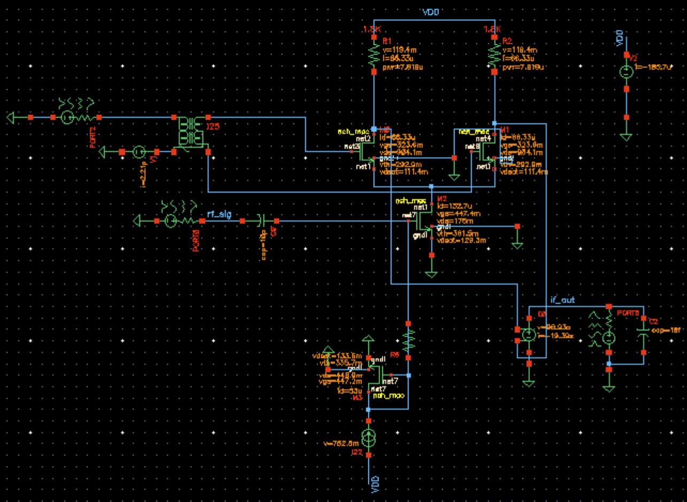
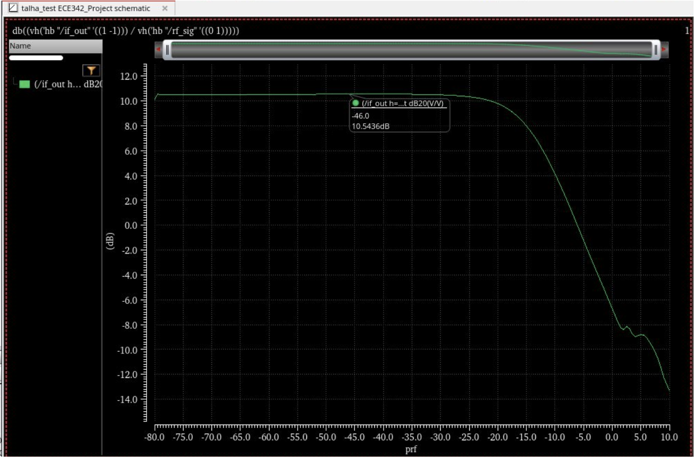
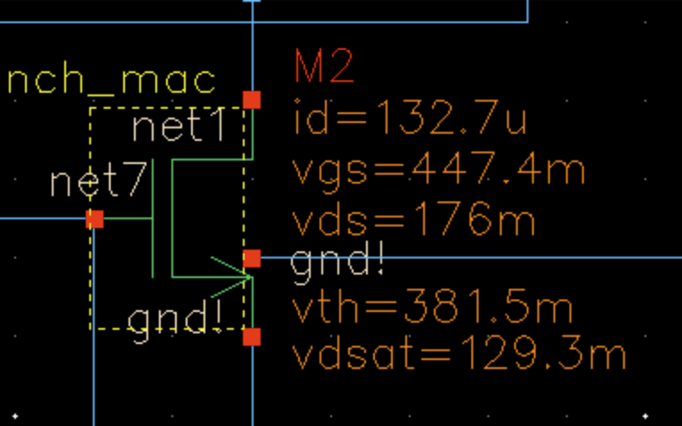

# Active Mixer 

## Overview

Active MOSFET mixer evaluated in two-tone harmonic-balance simulation, reporting conversion gain from RF input to IF output at the difference frequency (f_IF = f_LO - f_RF), plus an operating-point check confirming the bias device remains in saturation (V_DS > V_DSat) for stable bias current. :contentReference[oaicite:0]{index=0}

## Schematic

## Conversion Gain vs RF Input Power (prf)
- Gain is approximately constant at low RF input power, then compresses as prf increases.

## Bias Device Saturation
- V_DS > V_DSat.

